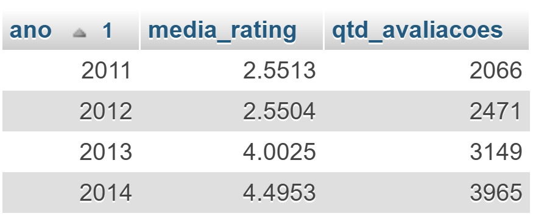
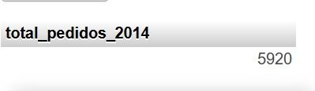
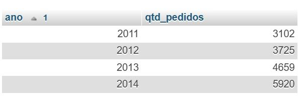
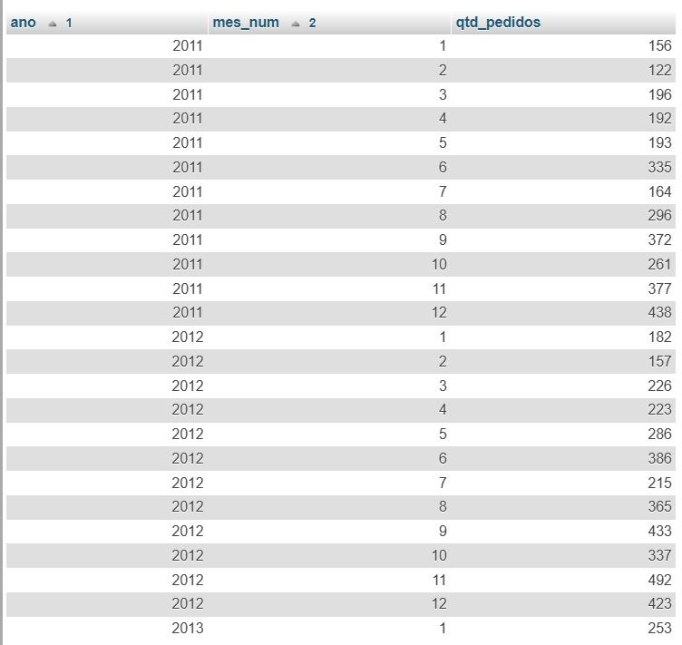
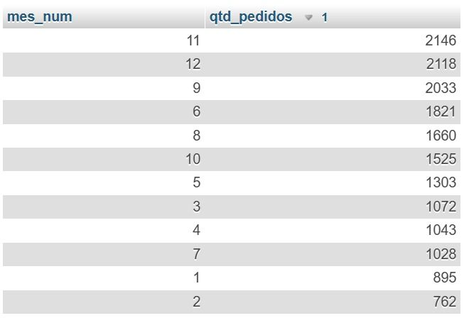
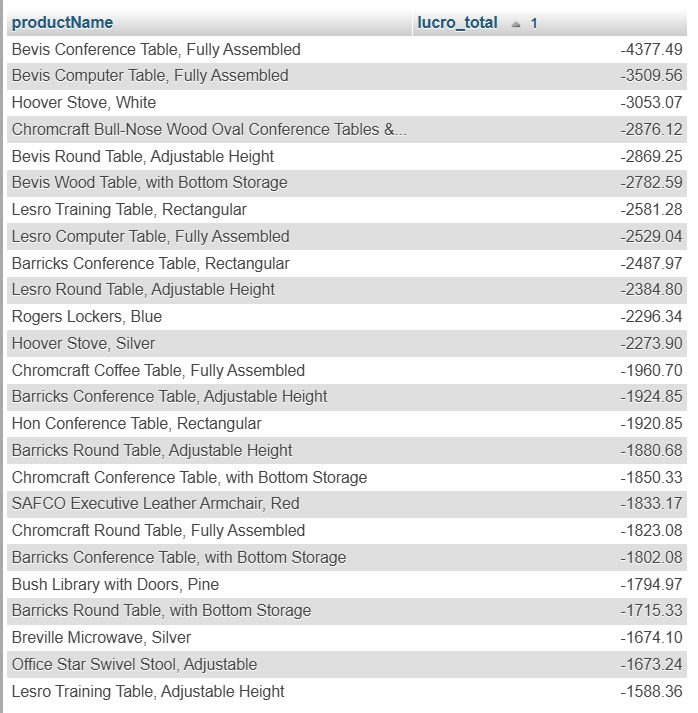
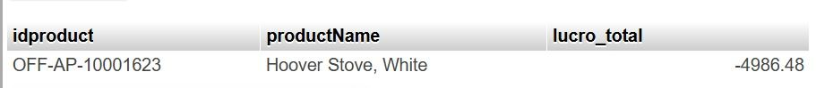
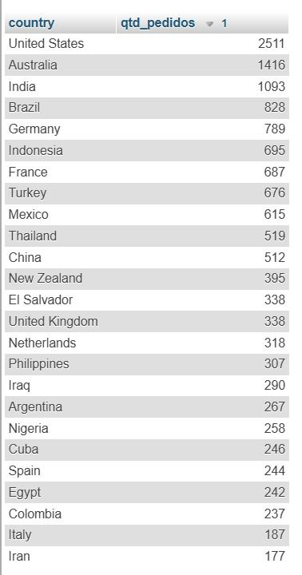
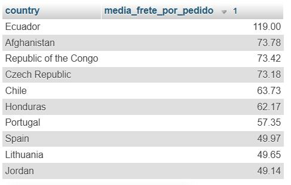

# Desafio Final BI — MySQL + Ratings (IGTI)

Este repositório contém as entregas do desafio final do bootcamp, usando:
- **MySQL** (base `desafiofinal.sql`)
- **CSV `rating.csv`** (avaliações de pedidos)

---

## Estrutura do repositório

- `sql/`
  - `01_rating_clean.sql` — importação/limpeza do rating (Projeto 1)
  - `02_projeto2_core.sql` — análises core (Projeto 2)
  - `03_projeto2_geo.sql` — análises geográficas (Projeto 2)
- `docs/` — evidências (prints) das consultas

---

## Como reproduzir

1. Importar o `desafiofinal.sql` no MySQL (phpMyAdmin / XAMPP).
2. Importar o `rating.csv` para uma tabela `rating` (ou equivalente).
3. Executar os scripts SQL na ordem:
   1. `sql/01_rating_clean.sql`
   2. `sql/02_projeto2_core.sql`
   3. `sql/03_projeto2_geo.sql`

---

# Projeto 1 — Pós-venda (ratings)

## Preparação dos dados
- Importação do `desafiofinal.sql` no MySQL
- Importação do `rating.csv` e criação da tabela `rating_clean` (ver `sql/01_rating_clean.sql`)
- Total de avaliações válidas em `rating_clean`: **11.651**

## Percentual de pedidos avaliados em 2014
- Total de pedidos em 2014: **5.920**
- Pedidos de 2014 com avaliação: **3.965**
- **Percentual de pedidos avaliados em 2014: 66,98%**

## Média de avaliação por ano

| Ano | Média | Qtd avaliações |
|---:|---:|---:|
| 2011 | 2,5513 | 2.066 |
| 2012 | 2,5504 | 2.471 |
| 2013 | 4,0025 | 3.149 |
| 2014 | 4,4953 | 3.965 |

**Conclusão (estratégia a partir de 2013):** a avaliação melhorou em 2013 e continuou melhorando em 2014.

## Evidências (prints)

---

# Projeto 2 — Vendas, Lucro e Geografia

## Período e volume da base
- Período analisado: **2011-01-01 a 2014-12-31**
- Total geral de pedidos: **17.406**
- Total de pedidos em 2014: **5.920**

### Evidências

---

## (Core) Pedidos — evolução no tempo
- Pedidos por ano:
  - **2011:** 3.102
  - **2012:** 3.725
  - **2013:** 4.659
  - **2014:** 5.920

- Meses com mais pedidos (ranking geral):
  - **11:** 2.146
  - **12:** 2.118
  - **09:** 2.033
  - **06:** 1.821
  - **08:** 1.660

### Evidências

---

## (Core) Vendas — crescimento 2013 → 2014
- Vendas 2013: **1.779.458,17**
- Vendas 2014: **2.216.414,26**
- Crescimento 2013 → 2014: **24,56%**

### Evidência

---

## (Core) Produtos e subcategorias
- **Subcategoria com maior total de vendas:** `Labels` (id 11) — **48.011,54**
- **Produto com maior prejuízo (lucro_total mais negativo):**
  - `OFF-AP-10001623` — *Hoover Stove, White* — **-4.986,48**

### Evidências

---

## (Core) Prioridade (priority)
- Resultado do recorte/consulta: **Medium — 470 pedidos**

### Evidência

---

## (Geo) Cobertura e distribuição por país
- **Quantidade de países distintos:** **108**
- **País com mais pedidos:** **United States — 2.511**
- **Brasil:** **4ª posição** no ranking de pedidos (**828**)

### Evidências

---

## (Geo) Frete — média por pedido
- **Maior média de frete por pedido:** **Ecuador — 119,00**
- Ranking (top 10) conforme print.

### Evidências

