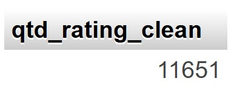
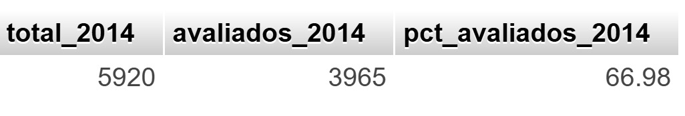

# Desafio Final BI — MySQL + Ratings (IGTI)

## Projeto 1 — Pós-venda (ratings)

### Preparação dos dados
- Importação do `desafiofinal.sql` no MySQL (XAMPP/phpMyAdmin)
- Importação do `rating.csv` e criação da tabela `rating_clean` (script em `sql/01_rating_clean.sql`)
- Total de avaliações válidas em `rating_clean`: **11.651**

### Percentual de pedidos avaliados em 2014
- Total de pedidos em 2014: **5.920**
- Pedidos de 2014 com avaliação: **3.965**
- **Percentual de pedidos avaliados em 2014: 66,98%**

### Média de avaliação por ano
| Ano | Média | Qtd avaliações |
|---:|---:|---:|
| 2011 | 2,5513 | 2.066 |
| 2012 | 2,5504 | 2.471 |
| 2013 | 4,0025 | 3.149 |
| 2014 | 4,4953 | 3.965 |

**Conclusão (estratégia a partir de 2013):** a avaliação **melhorou em 2013** e **continuou melhorando em 2014**.

## Como reproduzir
1. Importar o `desafiofinal.sql` no phpMyAdmin
2. Importar o `rating.csv` na tabela `rating`
3. Executar `sql/01_rating_clean.sql`

<!-- update -->